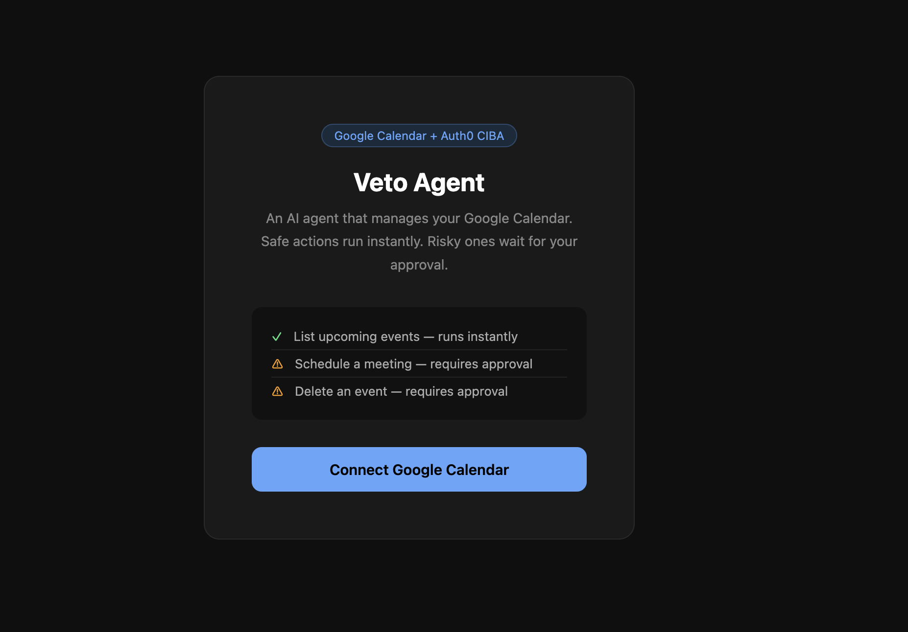
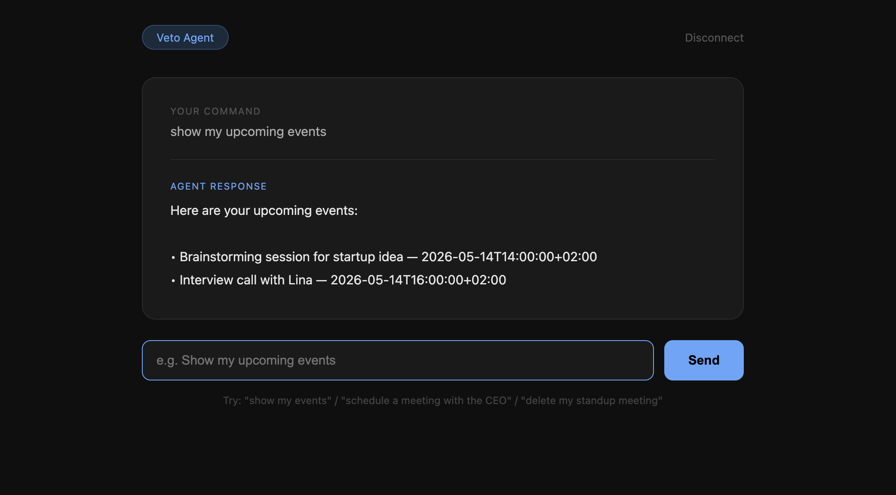
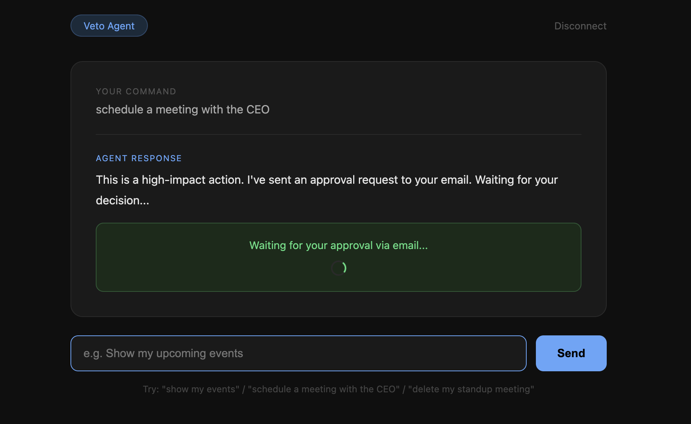
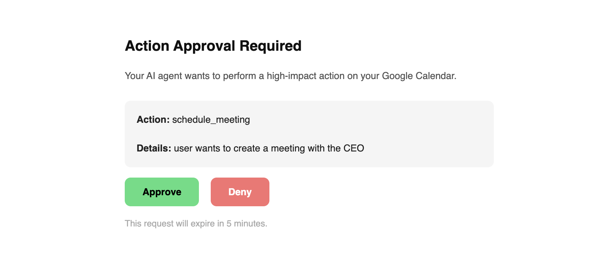
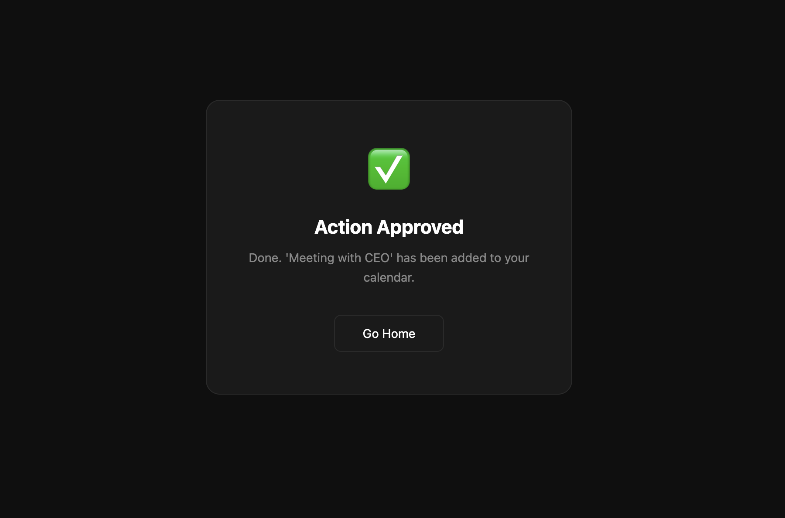
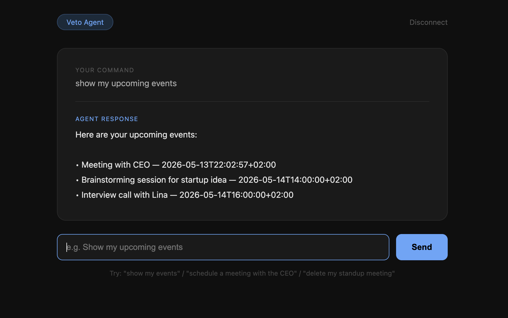

# Veto Agent

AI agents are powerful but dangerous. Once you give an agent access to your calendar, email, or Slack — what stops it from doing something you didn't actually want?

This project answers that. Veto Agent connects to your Google Calendar and handles natural language commands. Safe actions like listing events run instantly. But anything risky — scheduling a meeting, deleting an event — gets paused. The agent sends you an approval email, and nothing happens until you say so.

---

## The Problem

Most AI agent demos look great until you ask: "what if the agent does something wrong?" There's usually no answer. The agent has full access and full autonomy. That's fine for a demo but genuinely scary for anything real.

The async authorization pattern solves this. For any high-impact action, the agent pauses, notifies you through a separate channel (email in this case), and waits. You approve or deny from outside the app entirely. The agent resumes only after you say so.

---

## How it works

```
User gives a command
        ↓
Groq classifies the intent
        ↓
Safe action? → executes immediately
        ↓
High-impact action? → agent pauses
        ↓
Approval email sent with Approve / Deny links
        ↓
User clicks from their inbox (out-of-band)
        ↓
Agent executes or stops based on decision
```

---

## Demo

### 1. Home Page — connect your Google Calendar
<div align="center">
  
</div>

<br>

### 2. Ask the Agent — natural language commands
<div align="center">
  
</div>

<br>

### 3. High-Impact Action — agent detects risk and pauses
<div align="center">
  
</div>

<br>

### 4. Approval Email — sent to your inbox with Approve / Deny buttons
<div align="center">
  
</div>

<br>

### 5. Action Approved — event created on Google Calendar
<div align="center">
  
</div>

<br>

### 6. Back to Agent — check your upcoming events after approval
<div align="center">
  
</div>

---

## Tech Stack

| Tool | What it does |
|------|-------------|
| Groq | Classifies user commands and extracts intent (llama-3.3-70b-versatile) |
| Google Calendar API | Reads, creates, and deletes calendar events |
| Google OAuth 2.0 | Handles secure authentication with Google |
| Flask | Web framework, approval webhook endpoints, email sender |
| Python + uv | Backend and package management |

---

## Project Structure

```
veto-agent/
├── app.py                   # Flask app, approval routes, email sender
├── agent.py                 # command classification and action execution
├── calendar_service.py      # Google Calendar OAuth and API calls
├── configs/
│   └── config.yaml          # port, high-impact action list, approval timeout
├── templates/
│   ├── home.html            # landing page
│   ├── chat.html            # chat interface with pending state
│   └── approval_result.html # approve/deny result shown after clicking email link
├── assets/                  # screenshots
└── .env.example             # environment variable template
```

---

## Setup Guide

### 1. Clone and install

```bash
git clone https://github.com/mhd-faizzan/veto-agent.git
cd veto-agent
uv venv
source .venv/bin/activate
uv add flask python-dotenv groq google-auth google-auth-oauthlib google-api-python-client pyyaml
```

### 2. Set up Google Calendar API

1. Go to [console.cloud.google.com](https://console.cloud.google.com) and create a new project
2. Go to **APIs & Services** → **Enable APIs** → search and enable **Google Calendar API**
3. Go to **APIs & Services** → **OAuth consent screen** → choose **External**
4. Fill in app name and your email, save and continue through all steps
5. Go to **Audience** → scroll to **Test users** → add your Gmail address
6. Go to **Credentials** → **Create Credentials** → **OAuth 2.0 Client ID** → choose **Desktop App**
7. Download the JSON file, rename it to `credentials.json`, place it in the project root

> `credentials.json` is in `.gitignore` and will never be pushed to GitHub.

### 3. Set up Gmail App Password

You need an App Password to send emails programmatically — your regular Gmail password won't work.

1. Go to [myaccount.google.com](https://myaccount.google.com)
2. Search **App Passwords** in the search bar
3. Create one, select **Mail** as the app
4. Copy the 16-character password (remove spaces)

### 4. Get a Groq API key

1. Go to [console.groq.com](https://console.groq.com)
2. Sign in and create a new API key
3. Copy it

### 5. Configure environment variables

```bash
cp .env.example .env
```

Fill in your `.env`:

```
GROQ_API_KEY=your-groq-api-key
SECRET_KEY=any-random-string
APPROVAL_EMAIL=your-email@gmail.com
SMTP_EMAIL=your-gmail@gmail.com
SMTP_PASSWORD=your-16-char-app-password-no-spaces
```

### 6. Run the app

```bash
python app.py
```

Open `http://localhost:5002` and click **Connect Google Calendar**. On first run, a browser window will open for Google OAuth — sign in and allow access. A `token.json` file will be saved so you won't need to do this again.

---

## Try these commands

| Command | Type | What happens |
|---------|------|-------------|
| "show my upcoming events" | Safe | Lists events instantly, no approval needed |
| "schedule a meeting with the CEO tomorrow" | High-impact | Agent pauses, approval email sent |
| "schedule a budget review meeting" | High-impact | Agent pauses, approval email sent |
| "delete my standup meeting" | High-impact | Agent pauses, approval email sent |

---

## Important Notes

- Keep the server running while waiting for approval — pending approvals are stored in memory, so restarting the server will lose them
- The approval link expires after 5 minutes
- On first run, Google will open a browser for OAuth — this only happens once, after that `token.json` handles it
- Make sure `credentials.json` and `token.json` are never committed — both are in `.gitignore`

---

## What I learned

Before this I had never thought about authorization in the context of AI agents. Most tutorials just give the agent full access and call it done. But in the real world, an agent with unchecked access to your calendar or email is a liability.

The async approval pattern — where the agent pauses mid-execution and waits for out-of-band consent — is actually how production AI agent systems handle sensitive operations. Building it from scratch made the concept click in a way that reading about it never would.

---

## Built by

[Muhammad Faizan](https://github.com/mhd-faizzan) during MLH Global Hack Week 2026.